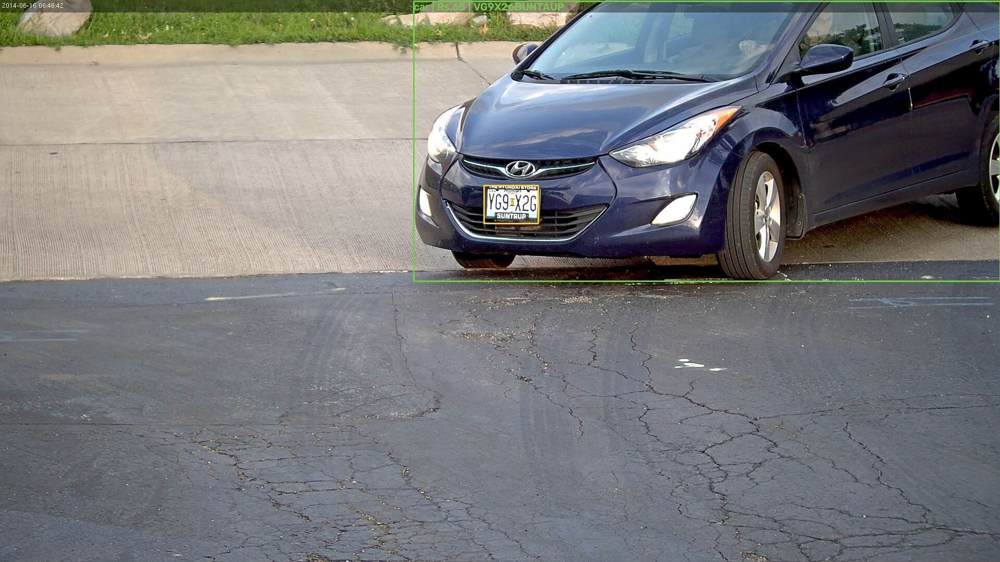

# 🛣️ Smart Tolling System

An AI toll plaza in your browser: upload a photo of traffic and the system
**detects vehicles, classifies them, locates and reads license plates, prices
the toll by vehicle class, and makes a gate decision** — with a web demo,
a REST API, and an honest benchmark against the classical-CV approach it
replaced.



## How it works

```
image ──▶ YOLOv8n (COCO) ──▶ vehicle boxes + class (car/bike/bus/truck)
              │ per-vehicle crop
              ▼
        YOLOv8 plate detector (fine-tuned) ──▶ plate box
              ▼
          EasyOCR + plate-aware cleanup ──▶ plate text
              ▼
   toll pricing by class + blacklist check ──▶ gate OPEN / CLOSED
```

Key engineering decisions:

- **Plate detection runs on each vehicle crop**, not the full frame — the
  plate is relatively larger there, which nearly doubled detection rate on
  distant surveillance shots.
- **OCR fragment scoring** prefers mixed letter+digit strings, filtering out
  dealer-frame text and state names that OCR as separate fragments.
- The original classical pipeline (Sobel + morphology + contour filtering)
  is kept in `src/smart_toll/classical.py` and benchmarked against the deep
  pipeline.

## Benchmark (OpenALPR benchmark images, CPU on Apple Silicon)

| Pipeline | Plate localized | Char accuracy | Avg time / image |
|---|---|---|---|
| Classical CV (v1) | 0/4 | 6% | 0.93s |
| YOLOv8 + EasyOCR (v2) | **3/4** | **39%** | **0.31s** |

Reproduce with `python scripts/benchmark.py`. Low-res distant plates keep
absolute OCR accuracy modest — plate *localization* is near-perfect (IoU
with ground truth > 0.3 on every detected plate); OCR on tiny crops is the
open bottleneck (see Roadmap).

## Quickstart

```bash
python3 -m venv .venv && source .venv/bin/activate
pip install -r requirements.txt

# CLI: process one image
python scripts/run_pipeline.py path/to/traffic.jpg --save annotated.jpg

# Web demo + API
uvicorn app.main:app --port 8080
# open http://localhost:8080
```

Models (YOLOv8n + a fine-tuned plate detector from Hugging Face) download
automatically on first run (~50 MB).

## API

`POST /api/process` (multipart image) →

```json
{
  "vehicles": [
    {
      "label": "car",
      "confidence": 0.95,
      "box": [794, 2, 1920, 540],
      "plate_box": [929, 356, 1033, 429],
      "plate_text": "VG9X26",
      "toll": {"toll_amount": 65, "allowed": true, "reason": "OK"}
    }
  ],
  "processing_seconds": 0.31,
  "annotated_image": "data:image/jpeg;base64,..."
}
```

## Project structure

```
src/smart_toll/
  detector.py    # YOLOv8 vehicle + plate detection
  ocr.py         # EasyOCR with plate-aware fragment scoring
  pipeline.py    # end-to-end orchestration
  pricing.py     # toll rates + gate decision
  classical.py   # legacy contour-based detector (benchmark baseline)
  viz.py         # annotation drawing
app/             # FastAPI backend + web UI
scripts/         # CLI runner + benchmark
data/samples/    # OpenALPR benchmark test images (gitignored)
```

## Roadmap

- [ ] Fine-tune plate detector on Indian plates (Kaggle dataset)
- [ ] Plate-specialized OCR (TrOCR / PaddleOCR comparison)
- [ ] Video pipeline with vehicle tracking (ByteTrack) → toll transaction log
- [ ] Fraud analytics: duplicate plates, impossible travel times, blacklists
  (Isolation Forest) + Streamlit dashboard
- [ ] Deploy demo to Hugging Face Spaces
